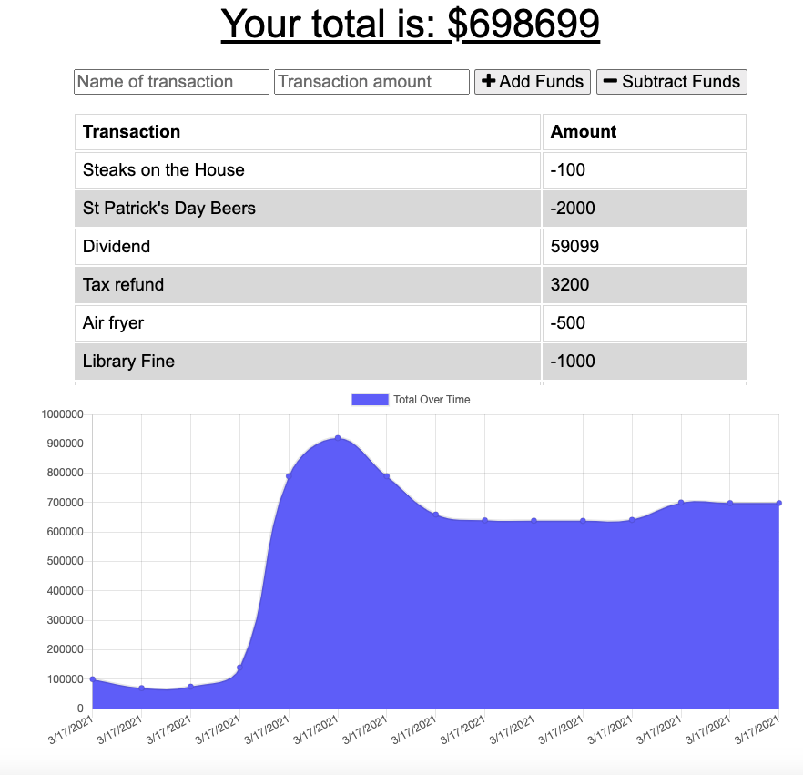

# Assignment18

This is the repo for the Online/Offline Budget Tracker assignment 18, due March 16, 2021.

# Unit 018 PWA Homework: Online/Offline Budget Trackers

Submitted: March 17, 2021, Michael O'Connor, 604 765-6061

# 01 Goal: 

The Goal of this project is to work with an example database application from 
class and add functionality to our existing Budget Tracker application to 
allow for offline access and functionality.  The user will be able to add 
expenses and deposits to their budget with or without a connection. 
When entering transactions offline, they should populate the total when 
brought back online.  Here is a link to the Github folder 
https://github.com/Emjayosee/Assignment18_Progressive_Budget and a link to the deployed 
website https://ledgerassignment18.herokuapp.com/.

# 02 Approach:

In approaching this project, I was determined to get it done, as close to on time 
as possible.  I used the starter code and then reviewed the class videos and the 
assignments.  I knew that elements of the files required would be found in the 
previous activities, and examples.  I added the db.js file from a similar app 
earlier in the week then I adjusted the reference at the top and the bottom of 
one of the other files and boom I found that it worked (wow I thought).  I knew 
that I did not have a service worker, but when I went through the app with TA 
worked through loading it on MongoDB and Heroku, Luca provided me the service 
worker and I added that feature and tweaked it into place, but found that it 
did not work. I reviewed the files at the top of the service worker file and 
saw I was missing the HTML file, and I added it.  Now it worked.

# 03 Testing and Quality Control:

    After completerly debugging the app. I have tested entering data online and offline and on different devices and then watching it up date.  I found that all of the features worked as expected.

# 04 Lessons Learned:

The following items should be considered for future enhancements, time and budget permitting:

    1. How to create an indexed DB.

    2. Reinforced deployoing apps on Heroku.

    3. Using Mongo DB and ROBO 3t with databases.

    4. Worked on debugging skills.

# 05 Further Improvements to Make:

    1. Incorporate an edit function.

    2. Add commas to the numbers and right justifying.

# 06 Current Renderings:

See Current Rendering at the time of writing in the Assignment18 Repo. 
 

